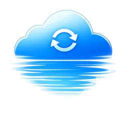

<p align="center">
  
</p>

# Mirage

[](https://github.com/archfill/mirage/actions/workflows/ci.yml)
[](LICENSE)
[](https://github.com/archfill/mirage)

[](README.ja.md)

A cloud file sync client for Linux.
Using a FUSE-based virtual filesystem, files are downloaded on demand while being accessible just like a regular directory.

## Features

- **On-demand download** - Files are downloaded only when opened, saving local storage
- **Always-sync mode** - Keep important folders permanently local (`mirage pin`)
- **Offline support** - Cached files remain readable and writable without a network connection
- **Fast directory operations** - Metadata is served instantly from a local database
- **LRU cache** - Cache size is managed automatically within a configured limit
- **System tray integration** - Supports KDE / GNOME / XFCE

## Installation

### Arch Linux

```bash
cd dist/
makepkg -si
```

## Usage

```bash
# Initial setup (connection test + save password to keyring)
mirage setup

# Start the daemon
mirage daemon start

# Mount
mirage mount ~/cloud

# Keep a file or folder permanently local
mirage pin ~/cloud/important

# Switch back to on-demand
mirage unpin ~/cloud/important

# Check sync status and cache usage
mirage status

# Unmount
mirage unmount

# View or change configuration
mirage config list
mirage config get server_url
mirage config set server_url https://cloud.example.com

# View daemon logs
mirage logs
mirage logs -f          # follow
mirage logs -n 50       # last 50 lines
```

## Architecture

```
[Cloud Storage Server]
       ↕ WebDAV (background sync)
[Local SQLite DB] ← metadata (filename, size, hash, ETag)
       ↕
[FUSE filesystem] → virtual file tree presented to user
       ↕
[Local cache]     ← actual files (downloaded on demand, LRU eviction)
```

## Tech Stack

- **Rust** - Memory safety, single binary distribution
- **fuser** - FUSE filesystem implementation
- **SQLite (rusqlite)** - Local metadata database
- **reqwest + tokio** - Async WebDAV communication
- **D-Bus** - Desktop environment integration

## Supported Backends

Currently targeting **Nextcloud (WebDAV)**. The backend layer is designed as an abstract trait, enabling future support for other cloud storage providers (Google Drive, OneDrive, S3, etc.).

## Documentation

- [Architecture](docs/architecture.md) - System design and technical decisions
- [Features](docs/features.md) - Feature list and specifications

## License

This project is licensed under the [MIT License](LICENSE).
